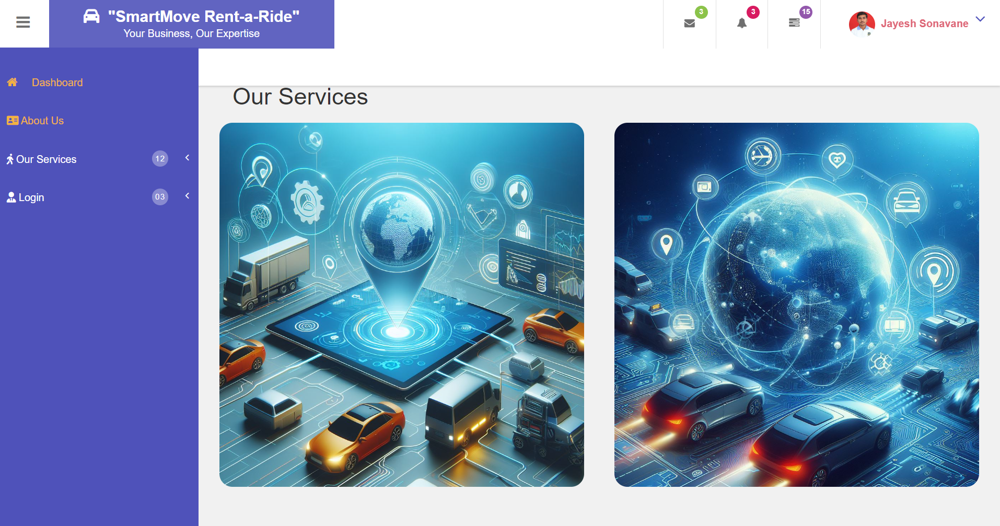
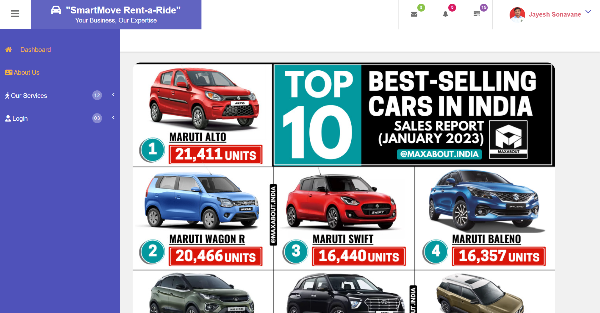
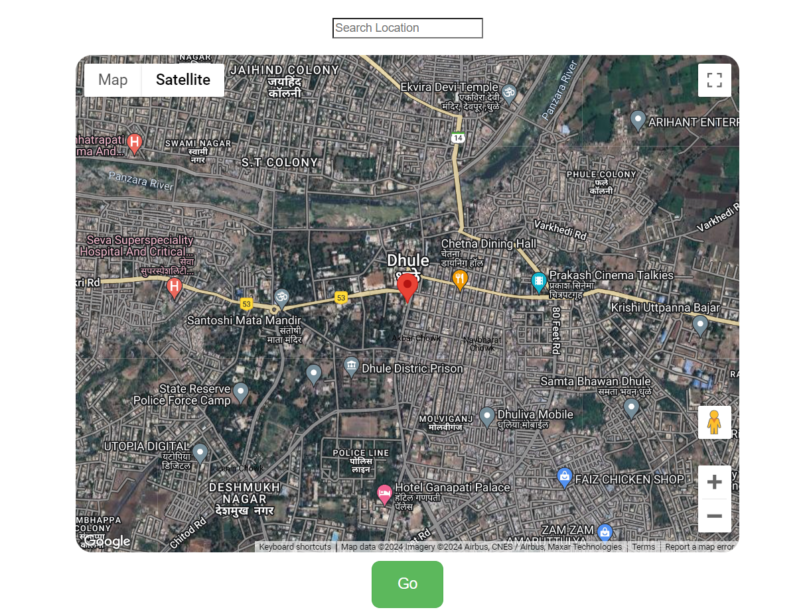
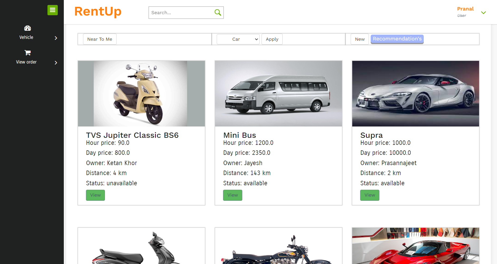

# 🚗 Smart Vehicle Rental Application 📱

An advanced application designed to revolutionize vehicle selection, optimize the booking process, and enhance the overall experience of vehicle rentals. This application integrates real-time tracking 🌐 and enhanced features for seamless vehicle booking and management.

## 📝 Index

- [Description](#description)
- [Features](#features)
- [Technologies Used](#technologies-used)
- [Getting Started](#getting-started)
  - [Prerequisites](#prerequisites)
  - [Installation](#installation)
  - [Usage](#usage)
- [Contributing](#contributing)
- [License](#license)
- [Contact](#contact)
## Images

**User Interface:**

**Home page:**

**Home page:**

**Capturing users Realtime Location**

**User Home**

## 📝 Description

The Smart Vehicle Rental Application is a sophisticated internet-based platform aimed at facilitating the hassle-free booking of vehicles according to customers' preferences and convenience. This system significantly simplifies the vehicle booking process for companies by centralizing all bookings within the application. Customers can access the services by logging in with their individual credentials, ensuring security and personalized service.

The application serves as a seamless interface connecting vehicle operators/administrators with customers. Its primary objective is to prioritize customer satisfaction by providing intuitive booking options. Customers can input journey details such as date and time, origin, destination, and preferred pick-up and drop-off points. Administrators have full control over the application, managing vehicle bookings and ensuring vehicle availability. They can also allocate drivers as needed and monitor the entire operation effectively.

Key information stored in the application includes vehicle model names, registration numbers, available vehicles, rental rates (per-day basis), driver profiles for security, and deposit amounts. Furthermore, machine learning concepts are employed to optimize the system's functionality, particularly in finding the nearest available vehicles.

In essence, this application offers a comprehensive solution for efficient vehicle booking, catering to the needs of both customers and administrators alike.

## 🚀 Features

- **Seamless Vehicle Selection:** Intuitive interface for customers to select vehicles based on their preferences and requirements.
- **Optimized Booking Process:** Streamlined booking process with options to input journey details and select pick-up/drop-off points.
- **Real-time Tracking:** Integration of real-time tracking for vehicles to provide customers with accurate location information.
- **Enhanced Functionality:** Incorporation of machine learning concepts to optimize system functionality, particularly in finding the nearest available vehicles.
- **User Authentication:** Secure login system for customers, ensuring their data privacy and personalized service.
- **Booking Management:** Comprehensive management system for administrators to oversee vehicle bookings, availability, and driver allocation.

## 🛠️ Technologies Used

- Java
- MySQL
- HTML
- CSS
- JavaScript
- Machine Learning concepts for location optimization

## 🏁 Getting Started

### Prerequisites

- Java JDK
- MySQL Database
- Web server (e.g., Apache Tomcat)
- Web browser

### Installation

1. Clone the repository.
https://github.com/jayeshsonavane2025/Smart-Vehicle-Rental-Application.git

2. Set up the database using MySQL.

3. Open the project in your Eclipse IDE.

### Usage

- Launch the application.
- Manage tasks, appointments, and client interactions.
- Connect with clients nearby and provide services efficiently.

## Contributing

Contributions are welcome! To contribute to the project, please follow the guidelines outlined in the CONTRIBUTING file.

## License

This project is licensed under the [MIT License](LICENSE.md) - see the LICENSE.md file for details.

## Contact
Feel free to contact me at jayeshsonavane2025@gmail.com for any questions, feedback, or collaboration opportunities.
